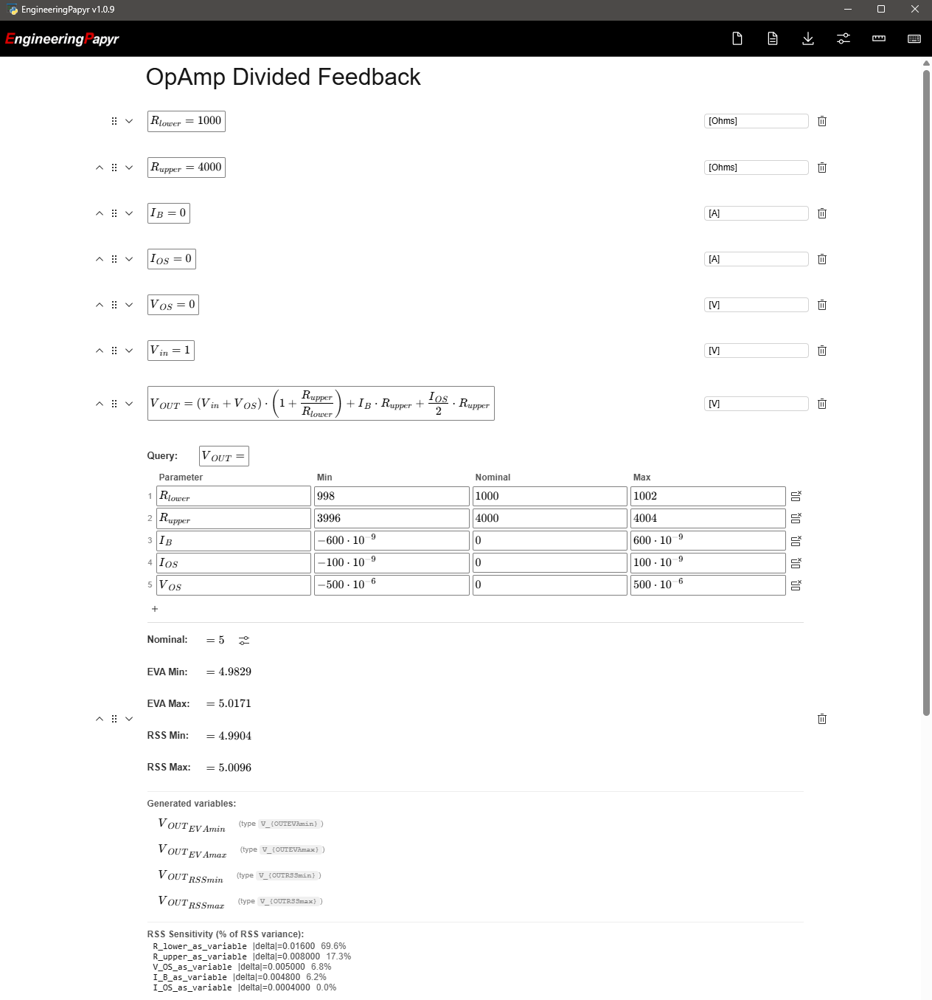

# EngineeringPapyr

A native Windows desktop build of [EngineeringPaper.xyz](https://engineeringpaper.xyz) using **PyWebView** + **native Python** instead of Pyodide/WebAssembly. Calculations run via native Python with SymPy — faster startup, faster computation (3-5x faster), and a smaller footprint.

---

## What Is EngineeringPaper.xyz?

A web app for engineering calculations with:
- Automatic unit conversion and dimensional analysis
- Plotting and data tables
- Systems of equations
- Documentation cells with rich text

---

## What's Different in EngineeringPapyr

EngineeringPapyr replaces that entire stack:

| Aspect | Original Standalone | EngineeringPapyr |
|--------|-------------------|------------------|
| Window | System browser (Chrome/Firefox) | Native window (Edge WebView2) |
| Python runtime | Pyodide (WASM, ~92MB) | Native Python |
| Computation engine | SymPy via Pyodide | SymPy via native Python |
| SymPy startup | ~10-15s (WASM load + init) | ~2-5s (native import) |
| Frontend | Svelte + KaTeX (same) | Svelte + KaTeX (same) |
| Frontend assets | ~165MB (includes pyodide/) | ~73MB (no pyodide/) |
| Code completion | Jedi via Pyodide Worker | Jedi via native Python |
| Packaging | Node.js exe via pkg | Embedded Python 3.12 + launcher exe |

All features are preserved: math cells, documentation cells, system solve cells, EVA/RSS analysis cells, code cells, plot cells, fluid cells, data tables, DOCX export (native pandoc via pypandoc), and PDF export (print dialog). Code cells can now import any pip-installed Python package on the computer.



---

## Additional Features 

Additional features maintained from [EngineeringPaperStandalone](https://github.com/animagr/EngineeringPaperStandalone)

### Annotation Column for Math Cells

Math cells have an optional annotation column to the right for units descriptions, notes, or labels (e.g., "velocity", "kg/m^3").

- Click a math cell to reveal the annotation input
- Saves automatically and persists with the sheet
- Included in Markdown/DOCX export as `*[annotation]*`

### Extreme Value Analysis (EVA) Cell

Finds worst-case min/max of an output expression by evaluating all 2^n combinations of input parameter bounds, plus sensitivity analysis. Supports up to 25 parameters (2^25 = 33,554,432 combinations) — made practical by using `lambdify` to convert SymPy expressions into fast NumPy functions, evaluating millions of combinations in seconds instead of hours.

1. Define parameters on the sheet (e.g., `V = 10 [V]`, `R = 1000 [Ω]`, `I = V / R =`)
2. Insert an EVA cell
3. Set the **Query** field to the expression to evaluate (e.g., `I=`)
4. Add parameter rows with **Parameter** name, **Min**, and **Max** values

### Root Sum Square (RSS) Analysis Cell

Statistical tolerance analysis cell that computes the RSS error envelope. Unlike EVA's worst-case (all tolerances at extremes simultaneously), RSS assumes parameter variations are independent and combines them as root-sum-of-squares.

1. Define parameters on the sheet
2. Insert an RSS cell
3. Set the **Query** field to the expression to evaluate
4. Add parameter rows with **Parameter** name, **Min**, **Nominal**, and **Max** values

### Example

The included `Example.epxyz` file demonstrates both EVA and RSS analysis on an op-amp non-inverting amplifier with divided feedback. It models `V_OUT` as a function of resistor tolerances (`R_lower`, `R_upper`), bias current (`I_B`), offset current (`I_OS`), and offset voltage (`V_OS`), showing worst-case bounds, statistical bounds, and per-parameter sensitivity.

Open it from the app via the file open button or drag and drop.

### Templates

The `templates/` folder contains ready-to-use `.epxyz` design worksheets:

- **Buck Converter** — Step-down converter power stage
- **Boost Converter** — Step-up converter power stage
- **Buck-Boost Converter** — Inverting converter power stage
- **Power Supply Topologies** — 20 topologies side-by-side (duty cycle, FET stress, diode stress) with a topology selection guide and control methods reference
- **ADC Resolution** — An ADC TUE resolution example

Open any template from the app, modify the input parameters, and all derived values update automatically.

### Code Cell: Standard Part Selector

A built-in Code Cell function for snapping calculated values to standard component series (0.1% resistors, 1% resistors, capacitors, inductors).

Insert a code cell and place this function inside to use it (SymPy Mode is only used if evaluating symbolic arguments, not numeric).

**Code Cell Function Definition:**

```
SelectStd([any], [any]) = [any]
```

**Code area:**

```python
from standard_parts import (
    std_res_01, std_res_1, std_cap, std_ind,
    select_nearest, select_up, select_down
)

# Mode: 1=RES 0.1%, 2=RES 1%, 3=CAP, 4=IND
#       Negative for next value DOWN, e.g. -1 = RES 0.1% round down
#       Add 10 for next value UP, e.g. 11 = RES 0.1% round up
_SERIES = {1: std_res_01, 2: std_res_1, 3: std_cap, 4: std_ind}

def calculate(target, mode):
    mode = int(mode)
    if mode > 10:
        series = _SERIES[mode - 10]
        return select_up(target, series)
    elif mode < 0:
        series = _SERIES[-mode]
        return select_down(target, series)
    else:
        series = _SERIES[mode]
        return select_nearest(target, series)
```

**Then in math cells:**

```
R_std = SelectStd(4870, 1) =        ← nearest 0.1% resistor
R_up = SelectStd(4870, 11) =        ← next 0.1% resistor up
R_down = SelectStd(4870, -1) =      ← next 0.1% resistor down
C_std = SelectStd(0.0000047, 3) =   ← nearest standard capacitor
```

### Code Cell: Electronic Part Stress Analysis (EPSA)

A built-in Code Cell function for checking component stresses against derating rules with automatic SMD package selection. Provide operating conditions (current for resistors, voltage for capacitors) and the module calculates stress, picks the smallest passing package, and outputs a CSV stress report.

Derating defaults: 80% voltage, 60% power. Resistor voltage rating uses the minimum of the package rating or the power-limited voltage (`sqrt(P_rated * R)`). To customize derating, set the module-level constants before calling `resistor()`/`capacitor()`:

```python
import part_stress
part_stress.VOLTAGE_DERATING = 0.70  # 70% voltage derating (default 0.80)
part_stress.POWER_DERATING = 0.50    # 50% power derating (default 0.60)
```

All inputs must be in SI base units (Amps, Volts, Ohms, Farads). Math cells with units (e.g. `0.42 [mA]`) auto-convert to SI before reaching the code cell. If entering raw numbers without units, use SI values directly (e.g. `0.42e-3` for 0.42 mA).

**Code Cell Function Definition:**

```
EPSA(I_{R1}, I_{R2}, V_{Cin}) = [text]
```

**Code area:**

```python
from part_stress import resistor, capacitor, stress_report

def calculate(i_r1, i_r2, v_cin):
    return stress_report(
        resistor("R1", 10e3, "1%", i_r1),
        resistor("R2", 4.7e3, "1%", i_r2),
        capacitor("C_IN", 100e-9, "10%", v_cin),
    )
```

**Then in math cells, define the operating conditions:**

```
I_{R1} = 0.42 [mA]
I_{R2} = 5 [mA]
V_{Cin} = 12 [V]
```

The output is a CSV report grouped by component type, one row per part:

```
Resistors
Ref,Package,Value(ohm),Tolerance,Current(mA),V_rated(V),V_derated(V),V_actual(V),V_stress,V_status,P_rated(mW),P_derated(mW),P_actual(mW),P_stress,P_status
R1,0201,10000,1%,0.42,15,12,4.2,0.35,PASS,50,30,1.764,0.059,PASS
R2,1206,4700,1%,5,34.28,27.42,23.5,0.857,PASS,250,150,117.5,0.783,PASS

Capacitors
Ref,Package,Value(pF),Tolerance,V_rated(V),V_derated(V),V_actual(V),V_stress,V_status
C_IN,0402,100000,10%,16,12.8,12,0.938,PASS
```

To force a specific package instead of auto-selecting: `resistor("R1", 10e3, "1%", i_r1, package="0805")`.

The function scales to any number of components — expand the code cell signature and `calculate()` arguments to match your design. For example, a design with 5 resistors and 3 capacitors:

**Code Cell Function Definition:**

```
EPSA(I_{R1}, I_{R2}, I_{R3}, I_{R4}, I_{R5}, V_{C1}, V_{C2}, V_{C3}) = [text]
```

**Code area:**

```python
from part_stress import resistor, capacitor, stress_report

def calculate(i_r1, i_r2, i_r3, i_r4, i_r5, v_c1, v_c2, v_c3):
    return stress_report(
        resistor("R1", 10e3, "1%", i_r1),
        resistor("R2", 4.7e3, "1%", i_r2),
        resistor("R3", 1e3, "5%", i_r3),
        resistor("R4", 100e3, "1%", i_r4),
        resistor("R5", 220, "1%", i_r5),
        capacitor("C1", 100e-9, "10%", v_c1),
        capacitor("C2", 10e-6, "20%", v_c2),
        capacitor("C3", 1e-6, "10%", v_c3),
    )
```

---

## How to Build and Run

### Prerequisites

- [Node.js](https://nodejs.org/)
- [Git for Windows](https://gitforwindows.org/) (includes Git Bash, required for building npm dependencies)
- Python 3.10 to 3.12 with pip (best compatibility with scientific packages)
- Edge WebView2 runtime (pre-installed on Windows 11)

### 1. Install Python dependencies

```Powershell
cd C:\Claude\EngPaper\EngineeringPapyr
py -3.12 -m pip install -r requirements.txt
```

### 2. Build the frontend

**Windows users:** Run `npm install` from **Git Bash**, not PowerShell or cmd. Some dependencies require bash to build.

```bash
cd C:\Claude\EngPaper\EngineeringPapyr\frontend
npm install
npm run build:native
```
If you get a `cross-env` not found error: `npm install cross-env`

Output goes to `frontend/public/`.

To clean build artifacts before rebuilding:

```bash
cd C:\Claude\EngPaper\EngineeringPapyr\frontend
rm -rf public/build
```

To clear the WebView2 browser cache (e.g., if the app shows stale images or assets after an update), close the app and delete:

```
%APPDATA%\pywebview\EBWebView
```

This folder is recreated automatically on next launch.

### 3. Run the app (recommended)

Running directly from Python gives code cells full access to your Python environment — any package you `pip install` is immediately available for import.

```Powershell
py -3.12 python/main.py
```

Or double-click `Run.bat` from the repo root.

### 4. Package as portable distribution

Builds a self-contained directory with an embedded Python 3.12 distribution, all pip dependencies, and a small launcher exe. Code cells have full access to the embedded Python environment — any package installed into it is available for import.

```Powershell
py -3.12 build.py
```

Output: `dist/EngineeringPapyr/` directory and `dist/EngineeringPapyr.zip`

The build script:
1. Builds the frontend (`npm run build:native`)
2. Downloads and sets up the Python 3.12 embeddable distribution
3. Installs all pip dependencies from `requirements.txt` into the embedded Python
4. Copies app source, frontend, and data files
5. Compiles a small launcher exe via PyInstaller
6. Creates a zip for distribution

Run `dist/EngineeringPapyr/EngineeringPapyr.exe` to launch the app. No system Python installation is required.

### 5. Adding packages to the portable distribution

To install additional Python packages into the embedded environment after building:

```Powershell
dist\EngineeringPapyr\python-3.12\python.exe -m pip install <package>
```

The package is immediately available for import in code cells on the next app launch. No rebuild is required.

---

## Dev Workflow

For iterating on frontend changes:

- **Terminal 1:** `cd frontend && npm run dev:native` (watches + rebuilds on save)
- **Terminal 2:** `cd .. && py -3.12 python/main.py` (launch app, restart manually after frontend rebuild)

---

## Architecture

```
PyWebView window (Edge WebView2)
  |
  |-- Loads Svelte frontend from local files (frontend/public/)
  |-- JS calls window.pywebview.api.solve_sheet(json)
  |-- JS calls window.pywebview.api.export_docx(json)
  |
  v
Native Python (python/api.py)
  |-- solve_sheet()  ->  dimensional_analysis.py (SymPy)
  |-- get_code_context()  ->  jedi_code_analysis.py (Jedi)
  |-- export_docx()  ->  pypandoc (native pandoc)
  |-- get_python_info()  ->  importlib.metadata
  |-- LRU cache (100 entries, replaces QuickLRU in JS)
```

The JS-Python boundary is 100% JSON strings in both directions. PyWebView runs API methods in background threads, so long computations don't freeze the UI.

### Key files

| File | Purpose |
|------|---------|
| `python/main.py` | PyWebView entry point, creates window |
| `python/api.py` | JS API bridge (solve_sheet, get_code_context, export_docx, get_python_info) |
| `python/dimensional_analysis.py` | Core computation engine (SymPy, ~4800 lines) |
| `python/jedi_code_analysis.py` | Code cell autocomplete via Jedi |
| `frontend/src/App.svelte` | Main app (calls `window.pywebview.api` instead of Web Workers) |
| `frontend/src/jediWrapper.ts` | Jedi bridge (PyWebView API instead of Worker) |
| `frontend/rollup.config.js` | Build config (no pyodide/jedi worker entries) |
| `launcher.py` | Tiny launcher script, compiled into the launcher exe |
| `pyinstaller_launcher.spec` | PyInstaller config for the launcher exe only |
| `build.py` | Build orchestrator (frontend + embedded Python + launcher) |

---

## Troubleshooting

- **SymPy first import takes 2-5 seconds** — the app shows "Loading Python..." during this, normal behavior
- **CoolProp fails to install** — skip it initially (`pip install` the rest manually), only needed for fluid cells
- **`npm install` slow** — expected, the mathlive/plotly GitHub dependencies take time
- **Python 3.13/3.14** — may have issues with scientific packages; use 3.10-3.12 for best compatibility

---

## License

MIT license, same as original.

See the original [EngineeringPaper.xyz](https://github.com/mgreminger/EngineeringPaper.xyz) project for license information.
